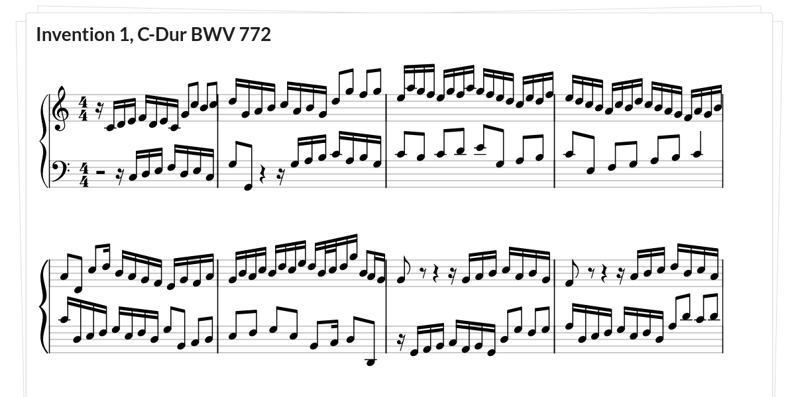
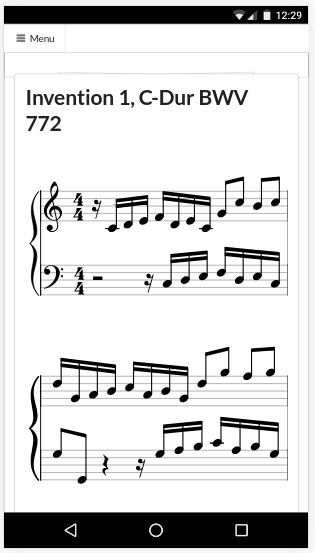

# Vexflow MusicXML parser [](https://travis-ci.org/bneumann/vexflow-musicxml)

__Dear visitors, thank you for your interest in my work. I have decided to discontinue the implementation and join the guys from opensheetmusicdisplay. They follow the same goals and it would not make sense trying to do it on my own. Just different. Feel free to contact me if you are interested in the code or just want to chat or buy me a beer. Thanks__

This is a ES6 approach to an easy Music XML renderer. It uses [Vexflow](https://github.com/0xfe/vexflow) to display the score. It does __not__ take care about the layout (at the moment) and always renders the score in respect to the given canvas. The VexRenderer class has an interface for layout calculations and redrawing if the dimensions change.

Please consider that this project is under development and needs some more care.

## Usage
If you want to use the library as is, you can checkout the npm package: https://www.npmjs.com/package/vexflow-musicxml
Just add it to your project with ```npm install --save vexflow-musicxml``` and require like this for ES6 Syntax:
```javascript
import Vex from 'vexflow-musicxml';
```
or classic JS require:
```javascript
var Vex = require('vexflow-musicxml');
```

To get it running you can create it like so:
```javascript
renderer = new Vex.Flow.MusicXmlRenderer(data, canvasReference);
```
```data``` is a XML string. So if you load your XML from the local PC or through your server you will need a XML to String parser to get the data.
```canvasReference``` is either a reference to a ```<div>``` element or a ```<canvas>``` element.

## Installation

```javascript
npm install
```
Grunt
```javascript
npm install -g grunt-cli
```

## Build
```javascript
grunt
```
## Test
```javascript
grunt test
```

## Debugging
There is a wepback development server configuration for debugging purposes. It uses the ```src/main.js``` script to load a file from the ```test/testdata``` folder. This is very convenient for live changes in the code. To start the server just hit npm test:
```
npm test
```
> For more details check the ```src/main.js``` file that is used by the webpack-server. Also have a look at the ```webpack.config.js``` file, particularly the include section. There you can include folders to your liking and call the files later on in the main.js file to be loaded and refreshed.

## Screenshots

Here are some shots from the current development:



It scales also to the small browser screens:



## Example

Apply like this:

```html
<!doctype html>

<html lang="en">
<body>
  <style>
  html, body, canvas {
    width:  100%;
    height: 100%;
    margin: 5px;
  }
  </style>
  <script src="../build/vexflow-musicxml.js"></script>
  <script>
    const reader = new FileReader();
    const openFile = function(event) {
      const input = event.target;
      reader.onload = function(){
        const text = reader.result;
        const node = document.getElementById('output'); // get the element where you want the score to be rendered
        const vex = new Vex.Flow.MusicXmlRenderer(text, node); // call the MusicXmlRenderer
      };
      reader.readAsText(input.files[0]);
    };

  </script>
  <form name="foo" method="post" enctype="multipart/form-data">
    <input type='file' accept='text/xml' onchange='openFile(event)'><br>
  </form>
  <canvas id='output' width='1280' height='1024'></canvas>
</body>
</html>
```

## Contributing

1. Fork it!
2. Create your feature branch: `git checkout -b my-new-feature`
3. Commit your changes: `git commit -am 'Add some feature'`
4. Push to the branch: `git push origin my-new-feature`
5. Submit a pull request :D

## History

* v0.1: First draft and working version
* v0.2: Changed the vexflow object creation and drawing to a more capsuled code. Added webpack-dev-server. Renamed VexRenderer to MusicXmlRenderer. Integrated the Attributes to Notes and Measures to be able to display according to screen size.

## Credits

TODO: Write credits

## License

MIT License

Copyright (c) 2017 Benjamin Giesinger

Permission is hereby granted, free of charge, to any person obtaining a copy
of this software and associated documentation files (the "Software"), to deal
in the Software without restriction, including without limitation the rights
to use, copy, modify, merge, publish, distribute, sublicense, and/or sell
copies of the Software, and to permit persons to whom the Software is
furnished to do so, subject to the following conditions:

The above copyright notice and this permission notice shall be included in all
copies or substantial portions of the Software.

THE SOFTWARE IS PROVIDED "AS IS", WITHOUT WARRANTY OF ANY KIND, EXPRESS OR
IMPLIED, INCLUDING BUT NOT LIMITED TO THE WARRANTIES OF MERCHANTABILITY,
FITNESS FOR A PARTICULAR PURPOSE AND NONINFRINGEMENT. IN NO EVENT SHALL THE
AUTHORS OR COPYRIGHT HOLDERS BE LIABLE FOR ANY CLAIM, DAMAGES OR OTHER
LIABILITY, WHETHER IN AN ACTION OF CONTRACT, TORT OR OTHERWISE, ARISING FROM,
OUT OF OR IN CONNECTION WITH THE SOFTWARE OR THE USE OR OTHER DEALINGS IN THE
SOFTWARE.
